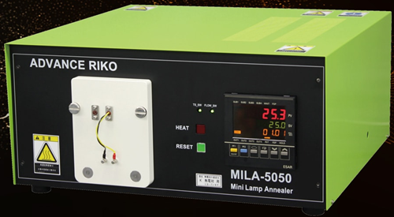
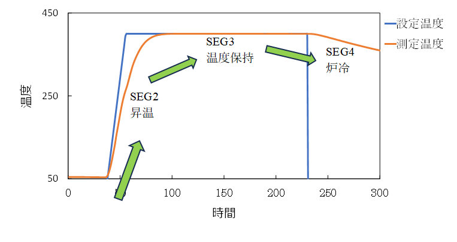

# RTA (急冷熱処理)の方法

作成：20205-12-09

## 前提
- RTA=Rapid thermal annealing （急速熱処理）
- 熱処理装置 MILA-5050Z

## 注意点
- 周りに可燃物がないか確認
- 内部の熱電対が壊れていると、最大出力で加熱されて（1200℃程度）、熱処理装置本体が壊れてしまうおそれがあるので、必ず、プログラム通り確認しているか確認すること。
- 真空と熱処理を同時に扱っているので、よくわからない現象が発生したら、ただちに先輩, スタッフに相談すること

## 手順
- 立ち上げ
- 熱処理装置本体の電源をON
- Chillerの電源をON。
- Arガスボンベの元栓が空いていることを確認。

## 試料セット

- 装置内が真空となっていることを確認（基本的にサンプルがないときも真空状態で管理）  
- 熱処理装置内部を大気圧に戻す。  
- TMP(ターボ分子ポンプ)バルブを閉じる。（必ず!!!!）
- TMPの電源を切る。
- 扉のねじを緩めてから，Arメーターバルブを緩めてArを入れる。  
　(Ar注入では管のバルブを触らない。常に開いた状態にする)  
　※Arを入れる際にTMPに異音や異常が生じた場合は、ただちにArの注入を止めて、真空にする。

- TMPにArが入ったことを示すので，TMPバルブをしっかり閉じる。  
- 0.01 Pa程度になったら，Arメーターバルブを閉じる。  
　(少し内圧が大気圧よりも高くする。これにより，装置内に大気（酸素や水蒸気など）が入りにくくなる)
- 扉を開けて試料を均質加熱される枠内にセットする。
- TMPの回転数が0 rpmであることを確認
- TMPバルブを全開にして少し閉める方向に戻し，装置の電源をON。
　最初にダイアフラムポンプが駆動し、その後、十分に内圧が低くなるとTMPが自動的に起動する。
- 内圧が低くなると扉のねじが緩むので閉める。
- 内圧が10^(-6) hPa（10-3Pa以下）程度になるまで待つ。

## 熱処理プログラムの設定

- 温度設定  
　- 目標温度と待機時間をそれぞれのSEGで設定する。  
　- SEG2で昇温速度設定，  
　- SEG3で熱処理温度設定を行う。  
　- 「EV1」：上限温度の設定，  
　- 「RPRPN」：熱処理の繰り返し回数（基本的に1）  
　- 「LNKPN」：他のPTNの熱処理につなげる（基本的に不要）

- PID制御の設定（基本的には設定不要）  
　- 引き出しに入っている「PZ900(PROTEM2) MILA-5050Z(J)」のCDからソフトをダウンロードする。CDを読み込む機械が棚に入っている。  
　- 異なる熱処理のプログラムを実施する際には要相談。  
　- PID制御の設定方法の詳細は、マニュアルに書かれている。  
　- 実際に加熱をし，トレンドグラフで熱処理の様子を観察しながらAT（オートチューニング）でPID設定。  
　- SEGごとの熱処理温度，熱処理時間を設定

## 熱処理の実行（大気圧付近で熱処理する場合）

- 大気圧に戻す
- TMPバルブを閉じる。
- TMP電源をOFF。
- 扉のねじを緩める。
- ‐0.02 Pa程度までAr 入れる。  
　（熱処理時に空気が膨張して内圧が上がりすぎないことを考慮。PV=nRTの関係）
熱処理プログラムを確認し，「RUN」を押す。
　（何か問題があれば「RESET」で停止。）  

- プログラム通りに温度が変化しているか最初の数分は確認（必ず!!!!）
- 目標温度以上に内部が上がりすぎていないか確認
- 熱処理後，室温程度（内部が酸化しないように、80℃以下まで）になるまで待機。
- 内圧を確認して、ガスがわずかに出ている状態で、ねじを緩めて、扉を開けて試料を取り出す。

## 立ち下げ
- 装置内を真空下に戻す。

- 扉を閉めて，ドライポンプの電源をON。  
　- 内圧が下がると扉のねじが緩むので閉める。  
　- 熱処理装置とChillerの電源をOFF。  

以上