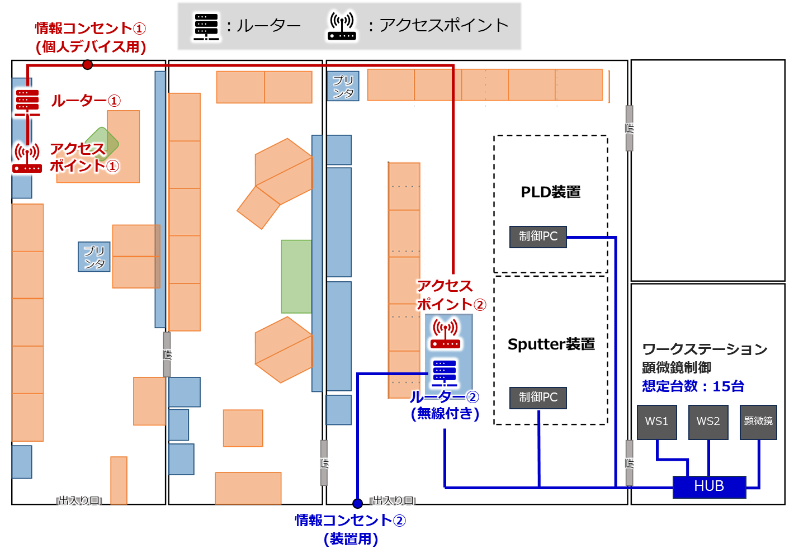

# Wi-fiルーターの設置・設定

研究室内ネットワークは，個人デバイス用と装置用の独立した２つのネットワークで構成されている。

## 個人デバイス用ネットワーク
### 構成
有線ルーター(Buffalo VR-U500X)に２台の無線アクセスポイントを設けている。

- アクセスポイント① : SSID : yamazakilab-staff
- アクセスポイント② : SSID : yamazakilab-

### 用途
- 各個人が所有するノートPC・スマホ・タブレットなどのデバイスを無線で接続
- 特に２つのアクセスポイントの用途は分けてないので，自分のデスクから速度テストを行って早い方に接続してよい。
- 100台以下の同時接続を想定

### 管理
- ルーター設定画面へのログイン名: yamazaki
- パスワード: xxx

## 装置用ネットワーク
### 構成
- 無線・有線対応ルーター(Buffalo VR-U300W)を設置
- SSID : machine-network-kotsugi

### 用途
- ローカル内またはVPNを介して装置PCと通信する
- SSH，リモートデスクトップ，大容量のデータ転送など
- Wi-Fi6対応なので個人デバイス用ネットワークより通信速度は速い
- 30台以下の同時接続を想定

### 管理
- ルーター設定画面へのログイン名: admin
- パスワード: xxx