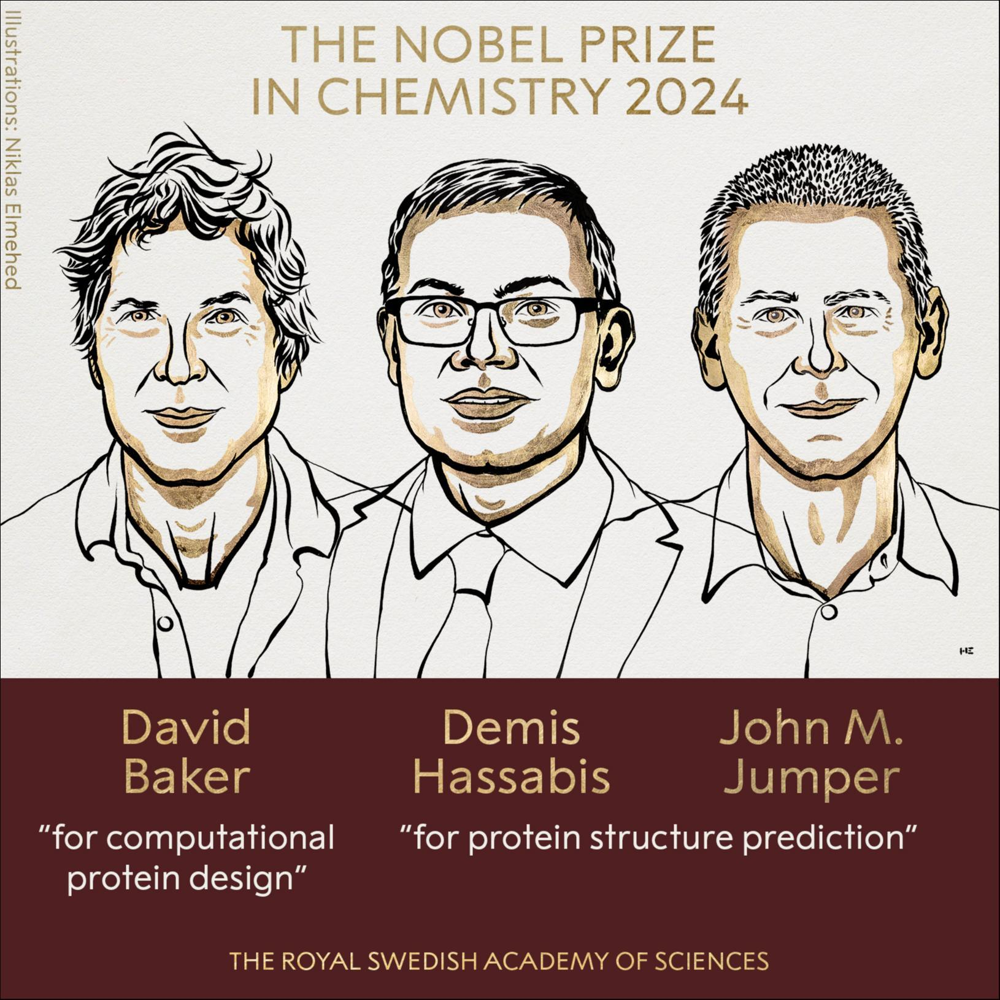

# 2024年ノーベル化学賞
計算によるタンパク質設計と立体構造予測が拓いた化学

2024年ノーベル化学賞は、タンパク質の立体構造を高精度に予測し、さらに新しいタンパク質を計算で設計できるようにした研究に与えられた賞である。分子の形と機能を結びつける「構造」に、計算とAIで直接アクセスできるようになった点が本質である。

## 参考ドキュメント
- Nobel Prize公式（プレスリリース）, Press release: The Nobel Prize in Chemistry 2024
  https://www.nobelprize.org/prizes/chemistry/2024/press-release/
- The Royal Swedish Academy of Sciences（科学的背景PDF）, Scientific background to the Nobel Prize in Chemistry 2024: Computational protein design and protein structure prediction
  https://www.nobelprize.org/uploads/2024/10/advanced-chemistryprize2024.pdf
- 産業技術総合研究所（AIST）マガジン, 2024年ノーベル化学賞「タンパク質設計と立体構造予測」とは？
  https://www.aist.go.jp/aist_j/magazine/20241211.html

## 1. 受賞者と授与理由

2024年ノーベル化学賞の受賞者は以下の3名である。

- David Baker（ワシントン大学）
- Demis Hassabis（Google DeepMind）
- John Jumper（Google DeepMind）

授与理由は、Baker が「計算によるタンパク質設計」、Hassabis と Jumper が「タンパク質立体構造予測」に対して、それぞれ賞の半分、残り半分を共同受賞する形で与えられた、というものである。

## 2. なぜ「タンパク質」が化学賞の中心なのか

タンパク質は、アミノ酸配列（一次構造）から折り畳まれて立体構造を取り、その形により化学的機能が決まる分子である。酵素反応、分子認識（結合）、電子移動、輸送、シグナル伝達など、生命現象の多くはタンパク質が担う化学反応・化学過程の集合である。

重要なのは次の連鎖である。

- 配列（sequence） → 折り畳み（folding） → 立体構造（structure） → 機能（function）

このうち「立体構造」を得るには、歴史的にはX線結晶構造解析やクライオ電子顕微鏡、NMRなどに依存してきた。これらは非常に強力だが、試料調製や測定・解析に時間がかかり、測れる対象にも条件がある。したがって、配列から構造を素早く得る計算手法は、化学の探索速度そのものを変え得る。

## 3. 立体構造予測：50年来の課題をAIで解いたとは何か

### 3.1 問題設定

タンパク質の立体構造予測は、配列 ${\mathbf{a}}=(a_1,\dots,a_L)$（長さL）から、原子座標 ${\mathbf{R}}$ を推定する問題として表せる。

化学的には「構造は自由エネルギーを下げる方向に決まる」という見方が基本であり、概念的には

$$
{\mathbf{R}}^* = \arg\min_{\mathbf{R}}\, G(\mathbf{R}\,|\,\mathbf{a})
$$

のように表現できる。ただし現実には、溶媒、複数状態、相互作用相手、翻訳後修飾などが絡むため、単純な最小化だけで決着する問題ではない。そこで、膨大な既知構造データと配列データ、共進化情報などを統合して推定する機械学習が強力になった。

### 3.2 AlphaFold 系の本質

Hassabis と Jumper らによるAIモデルは、配列から「距離や角度などの幾何情報」を高精度に推定し、全体として整合する3次元構造へ落とし込む枠組みを成立させた、と整理できる。結果として、タンパク質構造予測が長年抱えていた精度の壁を大きく突破し、多くのタンパク質で短時間に実用的な構造推定が可能になった。

### 3.3 予測が「化学」にもたらす変化

構造が分かると、次が急速に現実味を帯びる。

- 反応中心や結合ポケットの推定（触媒設計、阻害剤設計）
- 変異による安定性・機能変化の見積もり（分子改変の方向づけ）
- 複合体形成の理解（相互作用ネットワークのモデル化）
- 既知構造に依存しない新規分子機能の探索（構造空間の探索）

## 4. 計算によるタンパク質設計：自然界にないタンパク質を「書く」技術

### 4.1 予測（forward）と設計（inverse）

構造予測が「配列 → 構造」なら、設計は「目的の構造・機能 → 配列」を求める逆問題である。簡略化すると、

$$
{\mathbf{a}}^* = \arg\min_{\mathbf{a}}\, G(\mathbf{R}^*\,|\,\mathbf{a})
\quad \text{または} \quad
{\mathbf{a}}^* = \arg\max_{\mathbf{a}}\, P(\text{function}\,|\,\mathbf{a})
$$

のように書ける。ここで ${\mathbf{R}}^*$ は目標構造（または目標モチーフ）である。

### 4.2 Baker の貢献

Baker は、計算により新しいタンパク質を設計し、実際に合成・発現させて所望の構造・機能へ到達させる道を切り開いた。自然界に存在するタンパク質を少しずつ改変するだけでなく、「ほぼゼロから」目的に合わせて配列と折り畳みを作るという方向を現実のものにした点が評価の中心である。

設計が成立すると、化学としては「分子を見つける」から「分子を作る」へ重心が移る。特に酵素（触媒）や結合タンパク質（分子認識）の設計自由度は大きく、創薬、診断、環境浄化、バイオ素材などへ広く波及し得る。

## 5. 2024年化学賞の主題

| 観点 | タンパク質立体構造予測（Hassabis, Jumper） | 計算タンパク質設計（Baker） |
|---|---|---|
| 問題の向き | 配列 → 構造 | 目的 → 配列（構造・機能の逆問題） |
| 中心概念 | 幾何制約の整合、学習による推定 | エネルギー・安定性・機能要件に沿った探索 |
| 化学的な効き方 | 形が分かることで反応・結合の議論が加速する | 形や機能を狙って新しい分子を合成できる |
| 主な出力 | 3D構造モデル、信頼度の指標 | 新規配列、設計タンパク質、設計原理 |
| 影響の広がり | 疾患理解、創薬、分子機構理解 | 新規触媒、テーラーメイド結合分子、バイオ材料 |

## 6. 限界と今後の論点

高精度な予測や設計が可能になった一方で、なお残る課題もある。ここは誇張せず、化学としての前提条件を明確にしておく必要がある。

- 単一構造ではなく、多状態・準安定状態を取るタンパク質がある（機能に多状態性が関与する場合がある）
- リガンド、核酸、膜、金属中心、翻訳後修飾などが構造と機能に強く効く
- 予測や設計の確からしさは、学習に使える類似情報（配列多様性や既知データ）へ依存する側面がある
- 設計については、計算が出した配列が実験的に期待通りに折り畳むか、発現・安定性・溶解性なども含めて検証が要る

したがって、「予測・設計が可能になった」ことは、実験が不要になるという意味ではなく、実験と計算の分担が変わった、という意味で理解するのが筋がよい。

## まとめ
2024年ノーベル化学賞は、タンパク質の立体構造をAIで高精度に予測する技術と、計算により新しいタンパク質を設計する技術を、化学の中核的達成として位置づけた賞である。分子の形と機能をつなぐ構造情報へ高速に到達でき、さらに目的に応じて分子を設計できるようになったことで、化学の探索空間と速度は大きく拡張したと言える。

## 参考資料
- Nobel Prize公式（受賞要約）, The Nobel Prize in Chemistry 2024
  https://www.nobelprize.org/prizes/chemistry/2024/summary/
- AMED, トピックス 2024年ノーベル生理学・医学賞、化学賞
  https://www.amed.go.jp/news/topics/20241011-02.html
- JST Science Portal, ノーベル物理・化学2賞ともAI分野に…（国内解説）
  https://scienceportal.jst.go.jp/explore/review/20241017_e01/index.html
- 大阪大学 蛋白質研究所, ノーベル化学賞にタンパク質デザインと構造予測（国内短報）
  https://www.protein.osaka-u.ac.jp/notice/20241010-3/
