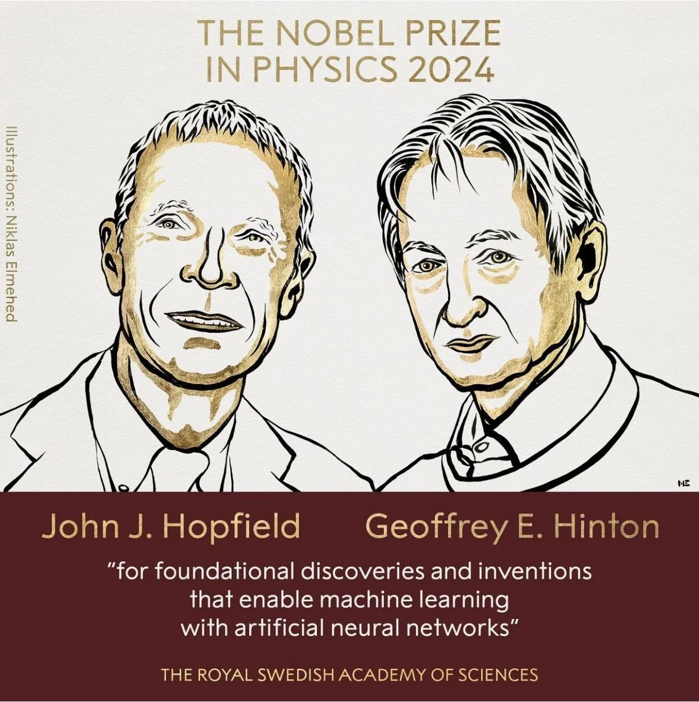

# 2024年ノーベル物理学賞
人工ニューラルネットワークによる機械学習

2024年ノーベル物理学賞は、人工ニューラルネットワークによる機械学習を、統計物理と多体系の視点で基礎づけた研究に与えられた賞である。連想記憶（Hopfield）と確率的生成モデル（Boltzmann machine）を、エネルギー地形と分配関数の言語で捉えることが要点である。

## 参考ドキュメント
- NobelPrize.org, Press release: The Nobel Prize in Physics 2024
  https://www.nobelprize.org/prizes/physics/2024/press-release/
- The Royal Swedish Academy of Sciences, Scientific Background to the Nobel Prize in Physics 2024 (PDF)
  https://www.nobelprize.org/uploads/2024/09/advanced-physicsprize2024.pdf
- 日本物理学会, 2024年ノーベル物理学賞は、「人工ニューラルネットワークによる機械学習」
  https://www.jps.or.jp/information/2024/10/2024novelprize.php

## 1. 受賞者と授与理由

2024年のノーベル物理学賞は、John J. Hopfield と Geoffrey Hinton に対して「人工ニューラルネットワークによる機械学習を可能にした基礎的発見と発明」という趣旨で授与された。

この授与理由が物理学と接続する核心は、学習・推論を
- 多数の素子が相互作用する系
- エネルギー（あるいは自由エネルギー）を最小化する緩和過程
- その確率版としてのボルツマン分布
として記述できる点にある。すなわち、ニューラルネットワークを単なる計算手続きとしてではなく、相互作用多体系の集団現象として扱い、安定状態・相転移・乱雑性・エネルギー地形といった物理の概念で整理する枠組みを与えたことに価値がある。

## 2. 人工ニューラルネットワークを「多体系」として見る

ニューラルネットワークの多くは、ノード（ニューロン）と重み（結合）の集合であり、状態ベクトル ${\mathbf{s}}$ が時間発展（更新則）によって変化する系として見なせる。

物理の語彙に翻訳すると、次の対応が自然である。

| 機械学習の語彙 | 物理の語彙 | 役割 |
|---|---|---|
| ノードの状態 ${s_i}$ | スピン変数（離散または連続） | 系のミクロ状態 |
| 重み ${w_{ij}}$ | 相互作用定数 | エネルギーの地形を決める |
| 活性化関数・更新則 | 緩和（ダイナミクス） | 平衡点（安定点）へ向かう力学 |
| 目的関数 | エネルギー / 自由エネルギー | 最小化される量 |
| ノイズ | 温度 ${T}$ | 確率的揺らぎ、探索能力 |

この対応は、Hopfield ネットワークで最も明瞭に現れる。

## 3. Hopfield ネットワーク：連想記憶のエネルギー最小化

### 3.1 基本方程式

Hopfield ネットワークは相互結合型（再帰型）のネットワークであり、各ノードが他のノードの状態から「局所場」を受け取り、その符号に従って更新される。

基本形は

$$
h_i = \sum_{j\ne i} w_{ij}s_j
$$

であり、非同期更新の例として

$$
s_i \leftarrow
\begin{cases}
1, & h_i>0\\
0, & h_i\le 0
\end{cases}
$$

のような閾値則が用いられる（${s_i}\in\{0,1\}$ の表現）。同等に ${s_i}\in\{-1,+1\}$ を採用する流儀も多く、その場合はバイアス項を含めた表式が便利である。

### 3.2 エネルギー関数と安定性

重みが対称である
$$
w_{ij}=w_{ji}
$$
という条件の下で、Hopfield ネットワークにはエネルギー関数が定義でき、更新に伴って単調に減少する。基本形の一例は

$$
E = -\sum_{i<j} w_{ij}s_i s_j
$$

である（表現の流儀により係数が変わることがあるが、要点は二体相互作用型の「スピン系のエネルギー」と同型である点にある）。

このエネルギーが更新とともに減っていくという事実は、力学がエネルギー地形の谷へ落ちていくことを意味し、局所最小点が「記憶」や「想起結果」に対応する。歪んだ入力が与えられても、近い谷へ緩和していくため、誤り訂正やパターン補完が起こる。

### 3.3 記憶の埋め込み（Hebb 則の基本形）

記憶パターン ${\boldsymbol{\xi}}^{\mu}$ を ${\mu=1,\dots,P}$ 個保持したいとき、基本的な重みの作り方として

$$
w_{ij} = \frac{1}{N}\sum_{\mu=1}^{P}\xi_i^{\mu}\xi_j^{\mu},
\qquad w_{ii}=0
$$

が用いられる（Hebb 則の基本形の一つである）。この構成により、記憶パターンがエネルギー地形の安定点（または準安定点）として現れ、連想記憶が実現される。

### 3.4 物理との接続：磁性体、平均場、スピングラス

上の式は、磁性体のスピン模型に極めて近い構造を持つ。局所場 ${h_i}$ は分子場（平均場）的な解釈を許し、エネルギーはスピン配列の安定性評価そのものである。さらに、記憶数が増えるにつれて乱雑性が増し、スピングラス理論と同様の議論が立ち上がる。ここに、統計物理の概念を機械学習へ「移植」できる理由がある。

## 4. Boltzmann machine：確率分布を学習するエネルギーベース生成モデル

### 4.1 Hopfield の確率版としての位置づけ

Hopfield ネットワークが「与えられたパターンへ緩和する連想記憶」を強く表現するのに対し、Boltzmann machine は「データが従う分布そのもの」を学習対象として定式化する。ここで中心となるのが、エネルギーに基づく確率モデルである。

### 4.2 ボルツマン分布と分配関数

状態 ${\mathbf{s}}=(s_1,\dots,s_N)$ の確率を

$$
P({\mathbf{s}})=\frac{1}{Z}\exp\left(-\frac{E({\mathbf{s}})}{T}\right)
$$

で定める。ここで $T$ は温度（探索の揺らぎを制御するパラメータ）、$Z$ は分配関数である。

$$
Z=\sum_{{\mathbf{s}}}\exp\left(-\frac{E({\mathbf{s}})}{T}\right)
$$

エネルギーの代表形は

$$
E({\mathbf{s}})= -\sum_{i<j} w_{ij}s_i s_j - \sum_i \theta_i s_i
$$

であり、${\theta_i}$ はバイアス（局所場）である。

### 4.3 可視層と隠れ層

Boltzmann machine では、観測される変数（可視ノード）だけでなく、分布の表現力を高めるために隠れノードを導入する。可視 ${\mathbf{v}}$ と隠れ ${\mathbf{h}}$ を合わせた状態を確率化することで、観測データの複雑な分布を近似できる。

この考え方は、後の制限ボルツマンマシン（RBM）や深い生成モデルへ接続した。RBM は結合構造を制限して計算しやすくした変種であり、深いネットワークの層ごとの事前学習に利用された歴史がある。

### 4.4 相関の差としての勾配

データ分布 ${p_{\mathrm{data}}(\mathbf{v})}$ に一致するようにモデル分布 ${p_{\theta}(\mathbf{v})}$ を学習するには、対数尤度

$$
\mathcal{L}(\theta)=\sum_{\mathbf{v}\in \mathcal{D}} \log p_{\theta}(\mathbf{v})
$$

を最大化する。エネルギーベースモデルでは、重みの勾配が概念的に

$$
\frac{\partial \mathcal{L}}{\partial w_{ij}}
\propto
\langle s_i s_j\rangle_{\mathrm{data}}
-
\langle s_i s_j\rangle_{\mathrm{model}}
$$

の形になる。すなわち、データが誘起する相関と、モデル自身が平衡で示す相関の差を縮める操作として学習が解釈できる。

ここで問題になるのが、$\langle \cdot\rangle_{\mathrm{model}}$ の計算が分配関数 $Z$ に結びつき、一般に高コストになる点である。これに対し、構造制約（RBM）や近似アルゴリズムが発展していった。

## 5. 1980年代から現在への接続：深層学習へどうつながったか

2024年の賞が強調したのは、現在の大規模学習が突然生まれたのではなく、1980年代に
- 再帰型ネットワークをエネルギー地形で理解した（Hopfield）
- それを確率化して分布学習へ拡張した（Hinton ら）
という「基礎骨格」が整っていた点である。

加えて、隠れ層を持つネットワーク学習を可能にする誤差逆伝播法（backpropagation）が 1980年代後半に整備され、深い表現学習が現実のデータ処理に接続された。ここでは、エネルギーベースの見方と、勾配最適化という見方が融合していく。

## 6. 方法としての還元と概念としての統一

この賞は「AIの応用」そのものよりも、物理を通して機械学習を理解可能にした点を評価するものと捉えられる。具体的には次が重要である。

1. 学習をエネルギー最小化として表すことで、安定性・収束・局所解の意味が明確化されること
2. 確率化により、分布推定・生成・不確かさの扱いが統計力学の形式に統一されること
3. 多体系の概念（相転移、ガラス性、自由エネルギー地形）が、学習現象の理解へ自然に流れ込むこと

これらは、ニューラルネットワークを「記号処理」から「物理系の集団現象」へと概念変換する働きを持ち、異分野間の翻訳装置として機能したと言える。

## 7. Hopfield と Boltzmann machine の比較

| 観点 | Hopfield network | Boltzmann machine |
|---|---|---|
| ノード状態 | 基本は二値（${0,1}$ または ${-1,+1}$） | 基本は二値だが確率的更新 |
| 目的 | 連想記憶、誤り訂正、パターン補完 | 分布学習、生成、特徴抽出 |
| 中心概念 | エネルギー地形の局所最小 | ボルツマン分布、分配関数、自由エネルギー |
| ダイナミクス | 決定論的（閾値更新）を基本とする | 確率的（温度で揺らぎを制御） |
| 物理との同型 | スピン系・平均場のエネルギー最小化 | 統計力学の平衡分布そのもの |
| 計算の難点 | 目的により局所解が問題になることがある | 平衡サンプリングと $Z$ の扱いが重い |

## 8. 国内研究の位置づけ

国内でもニューラルネットワークと物理の接点は長く議論されてきた。連想記憶や自己組織化、確率モデル、最適化、スピングラス理論との関係などは、国内の理論物理・情報数理・神経回路網研究の中で継続的に扱われてきた話題である。2024年の授与は、こうした研究が「物理学の枠内で正当に扱える」ことを国際的に再確認した出来事とも言える。

## 9. 用語整理

- 連想記憶：部分情報から全体パターンを想起する記憶形式である
- エネルギーベースモデル：確率や評価値をエネルギー関数で定義するモデル群である
- 分配関数 ${Z}$：全状態の重み付き和であり、正規化と自由エネルギーを支配する量である
- 自由エネルギー：$F=-T\log Z$ で定義され、確率モデルの“実効的な地形”を与える量である
- RBM：Boltzmann machine の結合を制限して計算性を高めたモデルである

## まとめ
2024年ノーベル物理学賞が示した中心は、学習をエネルギー地形の緩和と平衡分布として表すことで、人工ニューラルネットワークを統計物理の対象へと接続した点にある。Hopfield ネットワークは連想記憶をエネルギー最小化として定式化し、Boltzmann machine はその確率化によって分布学習と生成へ拡張した。これらは現代の機械学習の直接の完成形ではないが、学習現象を物理の言語で理解するための土台として、今も強い影響を持つ枠組みである。

## 参考資料
- J. J. Hopfield, Neural networks and physical systems with emergent collective computational abilities, PNAS (1982)
- D. H. Ackley, G. E. Hinton, T. J. Sejnowski, A learning algorithm for Boltzmann machines, Cognitive Science (1985)
- D. E. Rumelhart, G. E. Hinton, R. J. Williams, Learning representations by back-propagating errors, Nature (1986)
- P. Smolensky, Information processing in dynamical systems: Foundations of harmony theory, (1986)
- E. Ou, Artificial boundaries, Nature Physics (2024)
- 産業技術総合研究所（AIST）広報記事, 2024年ノーベル物理学賞「人工ニューラルネットワークによる機械学習」（国内解説）
  https://www.aist.go.jp/aist_j/magazine/20241204.html
- JST Science Portal, ノーベル物理学賞、機械学習の基礎を築いた2氏に（国内ニュース）
  https://scienceportal.jst.go.jp/newsflash/20241008_n01/
