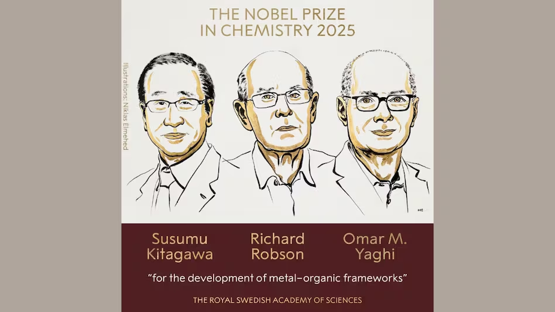

# 2025年ノーベル化学賞
金属有機構造体（MOF）と空間を設計する化学

2025年ノーベル化学賞は、分子を「作る」だけでなく、分子の並び方によって内部空間を持つ結晶を「設計する」化学を確立した点を讃えるものである。金属有機構造体（metal–organic frameworks; MOF）は、吸着・分離・貯蔵・触媒などで「空間そのもの」を機能として使える材料群である。

## 参考ドキュメント
1. Nobel Prize in Chemistry 2025: Press release, NobelPrize.org
2. Scientific Background to the Nobel Prize in Chemistry 2025: Metal–Organic Frameworks (PDF), NobelPrize.org
3. Science Portal（JST）「ノーベル化学賞に京大・北川氏ら3氏 気体を貯蔵できる金属有機構造体『MOF』を開発」

## 1. 受賞の概要

### 1.1 受賞者と授賞理由
- 北川 進（京都大学）
- Richard Robson（University of Melbourne）
- Omar M. Yaghi（University of California, Berkeley）

授賞理由は「金属有機構造体（MOF）の開発」である。

### 1.2 何が新しかったのか
焦点は、分子を離散的に合成する化学の延長ではなく、金属イオン（あるいは金属クラスター）と有機配位子を自己組織化させ、結晶中に大きな空隙（cavity）を恒久的に内包する「分子アーキテクチャ」を作り出した点にある。MOFの特徴は次の三点に要約できる。

- 結晶である：原子配置が規則的で、構造と物性を結びつけやすい
- 多孔体である：気体や分子が内部に出入りでき、吸着・分離が可能である
- 設計自由度が高い：金属種、配位子、トポロジー、官能基、欠陥などを変数として扱える

## 2. MOFの基本：ノードとリンカーから空隙が生まれる

### 2.1 構成要素
MOFは、概念的には「ノード（節点）」と「リンカー（連結子）」からなる。

- ノード：金属イオン M、または金属酸化物クラスター（secondary building unit; SBU）
- リンカー：多座配位子 L（カルボキシラート、イミダゾラート、ピリジルなど）

単純化すると、ネットワークとして
$$
\mathrm{M + L \rightarrow (M\text{–}L)_{\infty}}
$$
のような無限配位高分子である。重要なのは、生成物が単なる高分子ではなく、空隙を保った結晶格子として安定化されることである。

### 2.2 代表的な構造イメージ
- 「角」として働く金属（あるいはSBU）を、有機リンカーが梁のようにつなぐ
- その結果、格子の中に“部屋”が形成され、分子が出入りできる

この「部屋のサイズ」「入口のサイズ」「内壁の化学性」が、吸着・分離・触媒に直結する。

### 2.3 MOFと関連概念
用語は文脈で揺れるため、関連用語の定義を示す。

| 用語 | 大まかな意味 | コメント |
|---|---|---|
| 配位高分子（coordination polymer） | 金属と配位子が無限に連結した構造 | 空隙がなくても該当する |
| 多孔性配位高分子（PCP） | 配位高分子のうち多孔性を示すもの | 日本発の文脈でよく使われる |
| MOF | 多孔性を持つ配位ネットワーク材料の総称 | 実質的にPCPと大きく重なる |

## 3. 「設計できる多孔体」を支える考え方

### 3.1 形を作る指針：トポロジー（ネットワーク）という言語
MOFの設計では、分子の詳細だけでなく、結晶をネットワークとして抽象化する発想が効く。ノードの結合数（connectivity）とリンカーの幾何によって、得られるネット（網目）がある程度予測可能になる。

- 低次元（1D/2D）にならないように、連結数と立体配置を調整する
- 自由度の高い配位子は多形を生みやすく、狙いのネットに収束しにくいことがある
- 逆に、剛直な配位子やSBUは、再現性よく同じネットを与える傾向がある

### 3.2 欠陥と柔軟性：理想結晶からのずれが機能になる
MOFは「完全な結晶」だけで勝負していない。欠陥（missing linker / missing node）や、骨格の呼吸（flexibility）、ゲスト分子誘起の構造変化が機能を増幅する場合がある。

- 欠陥：吸着サイトや拡散経路を生む
- 柔軟性：圧力や吸着に応じた開閉（ゲーティング）を生む
- 官能基：内壁の極性や酸塩基性を変える

ただし、欠陥や柔軟性は安定性と表裏であるため、設計変数として扱う意識が必要である。

## 4. 物性の中核：吸着・分離をどう記述するか

MOFが「空間を使う材料」である以上、気体や溶媒分子の統計的な振る舞いが中心になる。

### 4.1 吸着等温線の基本式
低圧極限の吸着はヘンリー則で近似される。
$$
n(p) \approx K_{\mathrm{H}}\,p \quad (p \rightarrow 0)
$$
ここで $n$ は吸着量、$p$ は圧力、$K_{\mathrm{H}}$ はヘンリー定数である。材料間比較や、分離の第一近似に有用である。

単一サイトの飽和を含むモデルとして、ラングミュア式がある。
$$
n(p) = n_{\mathrm{sat}} \frac{b p}{1 + b p}
$$
$n_{\mathrm{sat}}$ は飽和吸着量、$b$ は親和性を表すパラメータである。

### 4.2 表面積評価とBET
多孔体の評価では比表面積が頻出であり、BET式が参照される。
$$
\frac{p}{n(p_0-p)} = \frac{1}{n_m C} + \frac{C-1}{n_m C}\frac{p}{p_0}
$$
$p_0$ は飽和蒸気圧、$n_m$ は単分子層吸着量、$C$ は吸着エネルギーに関係する定数である。
BETは便利である一方、微孔材料では適用範囲の扱いが難しくなるため、式の前提（多層吸着など）を意識した読み方が要る。

### 4.3 分離性能の表現：選択性
混合気体の分離を定量化する最も素朴な指標は選択性である。
$$
S_{A/B}=\frac{x_A/x_B}{y_A/y_B}
$$
$y$ はバルク（供給側）のモル分率、$x$ は吸着相（内部）のモル分率である。吸着サイトの化学性と細孔サイズが直接効く。

## 5. 多孔性材料の中でのMOFの位置づけ

MOFは既存の多孔体を置き換えるというより、設計自由度の高さで新しい探索空間を開いた材料群である。

| 材料カテゴリ | 構造の規則性 | 孔径の制御性 | 化学修飾の自由度 | 一般的な強み | 注意すべき点 |
|---|---:|---:|---:|---|---|
| ゼオライト | 高い | 高い | 低〜中 | 高耐熱・工業実績 | 組成・骨格の選択肢が限定的 |
| 活性炭 | 低い | 中 | 低 | 安価・大量生産 | 構造解析と設計が難しい |
| メソポーラスシリカ | 中 | 中〜高 | 中 | 孔径制御がしやすい | 化学的な吸着サイト設計は限定的 |
| MOF | 高い | 高い | 高い | 設計自由度が非常に高い | 水・熱・機械強度は系により差が大きい |

## 6. 応用：なぜ社会課題と結びつくのか

発表資料では、MOFが気体や分子の流入出を許す「部屋」を持つことが強調され、以下の用途が例示されている。

### 6.1 水の回収（低湿度からの吸着）
水分子は極性が強く、内壁の官能基・金属サイト・孔径分布に敏感である。乾燥地での夜間吸着・日中放出のように、吸着熱と拡散の設計が重要になる。

### 6.2 二酸化炭素の回収（排ガス・大気）
CO2は四極子モーメントを持ち、極性サイトやアミン様官能基、開放金属サイトで選択的に捕捉されることがある。単に吸着量を増やすだけではなく、再生エネルギー（脱着の容易さ）とのバランスが焦点になる。

### 6.3 水素の貯蔵
H2は小さく相互作用が弱いため、低温での物理吸着や高比表面積の活用が議論される。孔径最適化や軽元素骨格の設計が主要テーマになる。

### 6.4 有害ガスの捕捉、触媒反応場としての利用
内部空間は、反応物の濃縮・配向・拡散制御を同時に扱える「反応場」として働く。さらに、金属サイトや官能基を触媒点として埋め込める。

## 7. 合成と材料化：機能に到達するまでの要素

### 7.1 合成（自己組織化）の特徴
MOF合成は、配位結合の可逆性を利用して結晶性を獲得することが多い。代表的には溶媒熱条件などで結晶を育て、生成後に溶媒を置換・除去（活性化）して孔を開く。

### 7.2 安定性の論点
MOFは系ごとの差が大きい。たとえば、Zr系や一部のZIF系は水や熱に強い一方、金属–配位子結合が加水分解されやすい系もある。耐久性は、結合の強さだけでなく、骨格の疎水性、欠陥密度、粒子形態にも依存する。

### 7.3 形状付与（粉末から部材へ）
粉末結晶として優れていても、膜・ペレット・複合化などの形状付与で性能が変わり得る。吸着速度、圧損、熱輸送、機械強度は、結晶内部の性能とは別軸の要因として現れる。

## 8. データサイエンスとの接点

MOFは結晶構造が明確で、組成・構造・物性の対応付けがしやすい。そのため「構造記述子 → 物性予測 → 探索」という流れが組みやすい材料群である。

### 8.1 代表的なデータ表現
- 結晶構造（CIF）からの幾何特徴：孔径分布、accessible volume、比表面積、密度
- 化学特徴：金属種、官能基、極性、部分電荷
- トポロジー：ネットワークの種類、連結数、SBU分類

### 8.2 計算との役割分担
- DFT：局所サイトの相互作用、電荷移動、反応障壁の評価
- 分子シミュレーション（GCMC/MD）：吸着等温線、拡散、混合系分離の推定
- 機械学習：膨大な候補構造のスクリーニング、逆設計候補の生成

ここで重要なのは「予測値」を出すこと自体より、設計変数（孔径、官能基、金属サイトなど）が性能にどう効くかを説明可能な形で接続することである。

## 9. 受賞研究の歴史的意味

| 年代 | 進展（概略） | 意味 |
|---|---|---|
| 1980年代末 | 3D配位ネットワークの設計思想が提示される | 配位化学に「構造設計」の視点が強く入る |
| 1990年代 | 多孔性配位高分子（PCP）の体系化が進む | 吸着・可逆なゲスト取り込みが研究の核になる |
| 2000年代以降 | “MOF”という枠組みが一般化し設計空間が拡大 | 分離・貯蔵・触媒・水回収などへ展開する |

## 関連研究
- Nobel Prize in Chemistry 2025: Popular information, NobelPrize.org
- 京都大学ニュース「2025 Nobel Prize in Chemistry awarded to ... Susumu Kitagawa」
- Reuters（日本語）「ノーベル化学賞に北川進京大特別教授ら3人、金属有機構造体の開発」
- JST-CRDS 連載「第308回『ノーベル化学賞 基礎科学から新材料』」
- Nature（コレクション）Nobel Prize in Chemistry 2025 関連ページ
- UC Berkeley News: Omar M. Yaghi shares 2025 Nobel Prize in Chemistry
- Chem-Station（日本語解説記事）「2025年ノーベル化学賞になぜMOFが選ばれたのか?」

## まとめ
2025年ノーベル化学賞は、金属と有機分子を組み合わせて結晶内に機能空間を作り込むMOFの確立を通じ、化学を「分子の合成」から「空間の設計」へ拡張した点を評価したものである。MOFは設計自由度の高さゆえに、吸着・分離・貯蔵・触媒など多方面に広がる一方、安定性や材料化の要素も含めて性能が決まるため、構造・化学・統計熱力学を一体として扱う視点が今後も重要である。
