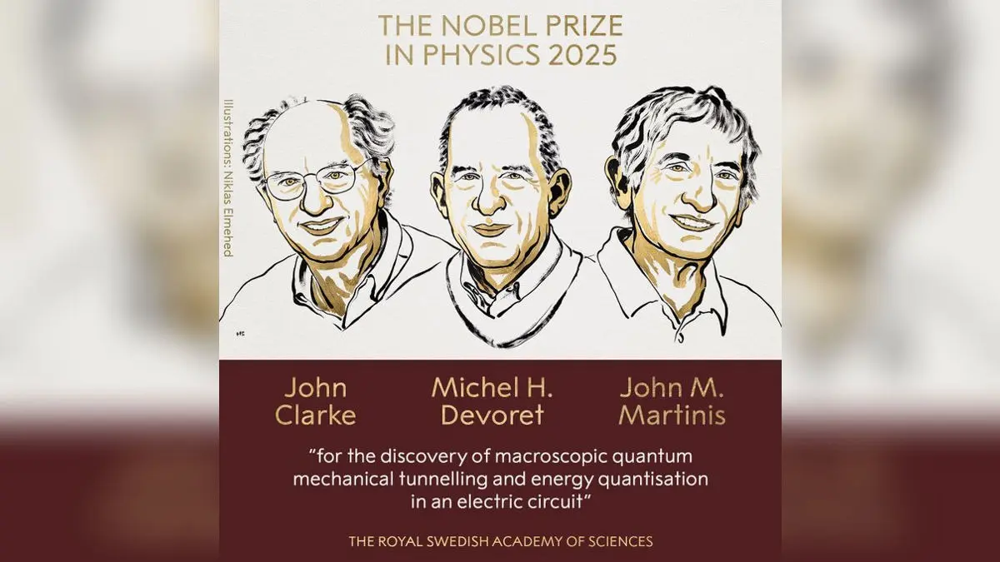

# 2025年ノーベル物理学賞
### 超伝導回路で実証された巨視的量子トンネルとエネルギー量子化

2025年ノーベル物理学賞は、手に持てる大きさの電気回路で量子トンネル効果と離散的エネルギー準位を実証し、巨視的スケールで量子力学を制御可能にした功績を対象とする賞である。超伝導回路は学理の検証系であると同時に、量子計測・量子情報へ直接つながる「工学化された量子系」である。

## 参考ドキュメント
1. Nobel Prize Outreach, Press release: Nobel Prize in Physics 2025
   https://www.nobelprize.org/prizes/physics/2025/press-release/
2. Nobel Prize Outreach, Scientific Background to the Nobel Prize in Physics 2025 (PDF)
   https://www.nobelprize.org/uploads/2025/10/advanced-physicsprize2025.pdf
3. 日本物理学会, 2025年ノーベル物理学賞 解説ページ
   https://www.jps.or.jp/information/2025/10/nobel2025.php

## 1. 受賞の概要

### 1.1 受賞者
- John Clarke（University of California, Berkeley）
- Michel H. Devoret（Yale University、University of California, Santa Barbara）
- John M. Martinis（University of California, Santa Barbara、Qolab）

### 1.2 授賞理由
電気回路における巨視的量子力学的トンネル効果とエネルギー量子化の発見に対して授与されたものである。

### 1.3 何が「物理学賞」なのか
量子力学は通常、原子・分子のような微小系で明瞭に現れると理解される。一方で、回路のような多自由度・多数粒子の系では、散逸や雑音により量子性が失われやすい。受賞研究は、超伝導という散逸の小さな舞台とジョセフソン接合という非線形要素を用いることで、巨視的な自由度が量子力学に従うことを実験で示した点に核心がある。

## 2. 量子性の「スケール」と「コヒーレンス」

### 2.1 巨視的量子性とは何か
巨視的量子性は「大きい物体が量子である」という言い方よりも、次の二点で定義する方が理解しやすい。

- 多数の粒子が協調して、少数の有効自由度（集団座標）として振る舞うこと
- その有効自由度が、量子力学の原理（量子化、トンネル、干渉）を示すこと

超伝導体では、クーパー対が巨視的波動関数で記述され、位相が集団座標として現れる。ジョセフソン接合はこの位相を非線形ポテンシャル中の変数として扱えるため、巨視的量子性の実験に適した要素となる。

### 2.2 「回路で量子」と言える条件
回路の自由度が量子力学に従うには、熱揺らぎと散逸が十分小さい必要がある。基礎的には

- 熱エネルギー：$k_{B}T$
- 量子準位間隔：$\Delta E$
- 散逸の強さ：品質係数 $Q$、あるいは有効減衰率 $\gamma$

が関与し、目安として
$$
k_{B}T \ll \Delta E
$$
が必要条件となる。さらに散逸が大きいと、準位は幅広がり、トンネルは抑制・修飾され得る。したがって「低温」と「低損失（高Q）」が同時に重要となる。

## 3. コア装置：ジョセフソン接合と超伝導回路

### 3.1 ジョセフソン効果の基本式
二つの超伝導体を薄い障壁で隔てたジョセフソン接合では、位相差 $\phi$ を用いて

- 電流位相関係：
$$
I = I_{c}\sin\phi
$$
- 電圧位相関係：
$$
V = \frac{\hbar}{2e}\frac{d\phi}{dt}
$$

が成り立つ。ここで $I_{c}$ は臨界電流、$e$ は電気素量である。

### 3.2 エネルギースケール：$E_{J}$ と $E_{C}$
ジョセフソン接合には二つの代表的エネルギーがある。

- ジョセフソンエネルギー：
$$
E_{J} = \frac{\hbar I_{c}}{2e}
$$
- 充電エネルギー（接合容量 $C$ に対して）：
$$
E_{C} = \frac{e^{2}}{2C}
$$

設計・動作領域は主に比 $E_{J}/E_{C}$ によって特徴づけられる。$E_{J}$ が支配的なら位相はよく定まり、$E_{C}$ が支配的なら電荷量子化が前景化する。

### 3.3 有効ハミルトニアン（基本形）
接合の量子力学は、位相 $\phi$ とクーパー対数 $n$（電荷自由度）を共役変数として
$$
[\phi, n] = i
$$
と置き、基本形として
$$
H = 4E_{C}(n-n_{g})^{2} - E_{J}\cos\phi
$$
で記述できる。$n_{g}$ はゲートや外部回路に由来する電荷オフセットである。

## 4. 巨視的量子トンネル（macroscopic quantum tunnelling; MQT）

### 4.1 洗濯板ポテンシャル（washboard potential）
外部からバイアス電流 $I$ を与えると、位相 $\phi$ は傾いた周期ポテンシャル中の粒子として理解できる。直感的な形として
$$
U(\phi) = -E_{J}\cos\phi - \frac{\hbar I}{2e}\phi
$$
を用いると、ある範囲の $I$ で局所的な井戸（準安定状態）ができる。

- 古典的には、粒子は井戸に捕獲され、電圧はゼロ近傍にとどまる。
- 量子力学的には、粒子は障壁をトンネルし、別の状態へ遷移する。

実験では、ゼロ電圧状態から有限電圧状態への「スイッチング」が観測量となりうる。

### 4.2 トンネル率の見方
ポテンシャル障壁の高さを $\Delta U$、井戸内小振動の角周波数（プラズマ周波数）を $\omega_{p}$ とすると、WKB的には
$$
\Gamma \propto \omega_{p}\exp\!\left(-\frac{S}{\hbar}\right)
$$
の形でトンネル率 $\Gamma$ が与えられる。ここで $S$ は井戸から障壁下を通る古典禁止領域の作用であり、散逸の存在は $S$ の有効値を増やす方向に働きやすい。

### 4.3 なぜ「巨視的」なのか
トンネルしている自由度は単一電子ではなく、超伝導を担う多数のクーパー対の集団座標である。したがって、観測されるトンネルは「多数粒子の協調運動が作る有効自由度」の量子トンネルである。

## 5. エネルギー量子化：回路が「人工原子」になる

### 5.1 井戸内準位の離散化
井戸の底付近では $U(\phi)$ を二次近似でき、調和振動子に近い。よって準位はおおまかに
$$
E_{m} \approx \hbar\omega_{p}\left(m+\frac{1}{2}\right)
$$
の形で離散化される。非線形性が強い場合は準位間隔は均一でなくなるが、逆にそれが分光学的に「人工原子」として扱える根拠となる。

### 5.2 吸収・放出の量子化
公式説明では、系が特定のエネルギーだけを吸収・放出することが示された点が強調される。これは、回路が連続的にエネルギーを受け渡しする古典振動子ではなく、固有準位間遷移を持つ量子系として働くことを意味する。

## 6. 量子技術への接続：量子ビットと量子計測

### 6.1 超伝導量子ビット（概念的説明）
超伝導回路を量子力学で扱うと、二つの準位を選び出して二準位系として利用できる。これが超伝導量子ビットである。ここでの要点は、材料固有の原子準位を使うのではなく、回路定数（$C$、$I_{c}$、インダクタンス）によって準位構造を設計する点にある。

### 6.2 何が応用を可能にしたのか
受賞研究が開いた扉は、次のように言い換えられる。

- 巨視的自由度の量子性を観測できる
- その量子性を、回路パラメータ調整により制御できる
- 計測系（電圧、電流、マイクロ波）で読み出せる

したがって、量子計算（量子ビット）、量子暗号、量子センサーの基盤へ連結しやすい。

## 7. 他方式との比較：どこが超伝導回路の特色か

### 7.1 量子プラットフォーム比較（基本）
| プラットフォーム | 担体となる自由度 | 操作手段 | 読み出し | 長所 | 課題 |
|---|---|---|---|---|---|
| 超伝導回路 | 位相・電荷の集団座標 | マイクロ波、磁束、バイアス | 回路計測（共振器など） | 設計自由度が大きい、集積化しやすい | 低温、雑音・散逸の制御が難しい |
| トラップドイオン | 原子準位 | レーザー | 蛍光 | 高いコヒーレンス | 速度・スケール化の工学難度 |
| 中性原子 | 原子準位、リドベルグ | レーザー | 画像・蛍光 | 大規模配列に向く | 均一性・誤差制御 |
| 固体スピン（NV等） | 電子スピン | マイクロ波、光 | 光学 | 室温動作の可能性 | 材料ばらつき、集積 |

ここで、超伝導回路の本質は「固体材料の集団を、回路として量子設計する」点にある。これは原子系とは異なる強みである。

## 8. 研究史

| 時期 | 進展 | 意義 |
|---|---|---|
| 1960年代 | ジョセフソン効果の理論・実験が確立 | 位相を回路変数として扱う基盤ができる |
| 1980年代 | 巨視的量子トンネルとエネルギー量子化の回路実証 | 巨視的自由度の量子制御が現実化する |
| 2000年代以降 | 超伝導量子ビットが多様化し、量子計測も進展 | 回路量子電磁力学など周辺理論・技術が拡大する |
| 2025年 | ノーベル物理学賞として評価 | 「量子の工学化」が物理学の中心課題であることが明確化する |

## まとめ
2025年ノーベル物理学賞は、超伝導回路という人工物の中で、量子トンネルとエネルギー準位量子化を実証し、巨視的自由度を量子力学で制御できることを示した功績を評価したものである。この成果は、量子力学の基礎検証に留まらず、量子計算・量子暗号・量子センサーへ直結する回路量子技術の根に位置づくものである。

## 関連研究
- Nobel Prize Outreach, Nobel Prize in Physics 2025 summary
  https://www.nobelprize.org/prizes/physics/2025/summary/
- Nobel Prize Outreach, Popular science background: Quantum properties on a human scale (PDF)
  https://www.nobelprize.org/uploads/2025/10/popular-physicsprize2025.pdf
- The Royal Swedish Academy of Sciences (KVA), The Nobel Prize in Physics 2025
  https://www.kva.se/en/news/the-nobel-prize-in-physics-2025/
- Reuters 日本語, 2025年ノーベル物理学賞の記事
  https://jp.reuters.com/world/us/GCNYD4IIOBIFLDA2DLAVXEDPKQ-2025-10-07/
- Physics Today (AIP), Clarke, Devoret, and Martinis share 2025 Nobel Prize in Physics
  https://physicstoday.aip.org/news/clarke-devoret-and-martinis-share-2025-nobel-prize-in-physics
- JBpress, 2025年ノーベル物理学賞の解説（ジョセフソン接合）
  https://jbpress.ismedia.jp/articles/-/91141
- 東洋経済オンライン, 2025年ノーベル物理学賞の解説記事
  https://toyokeizai.net/articles/-/910686?display=b
